# Painting: a Claude Code skill

Claude paints the way a painter works, and every mark is computed in code. It uses no image models and no reference images: it writes down how the picture should look, plans the values, lays the paint down in layers from ground to varnish, looks hard at the result and repaints.

| | |
|---|---|
| 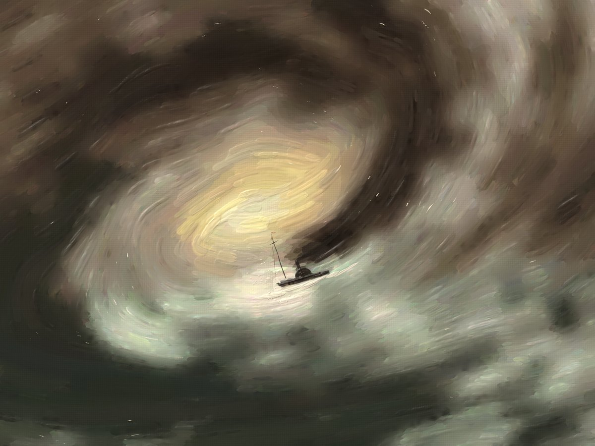 *The Eye of the Storm*, after J. M. W. Turner | 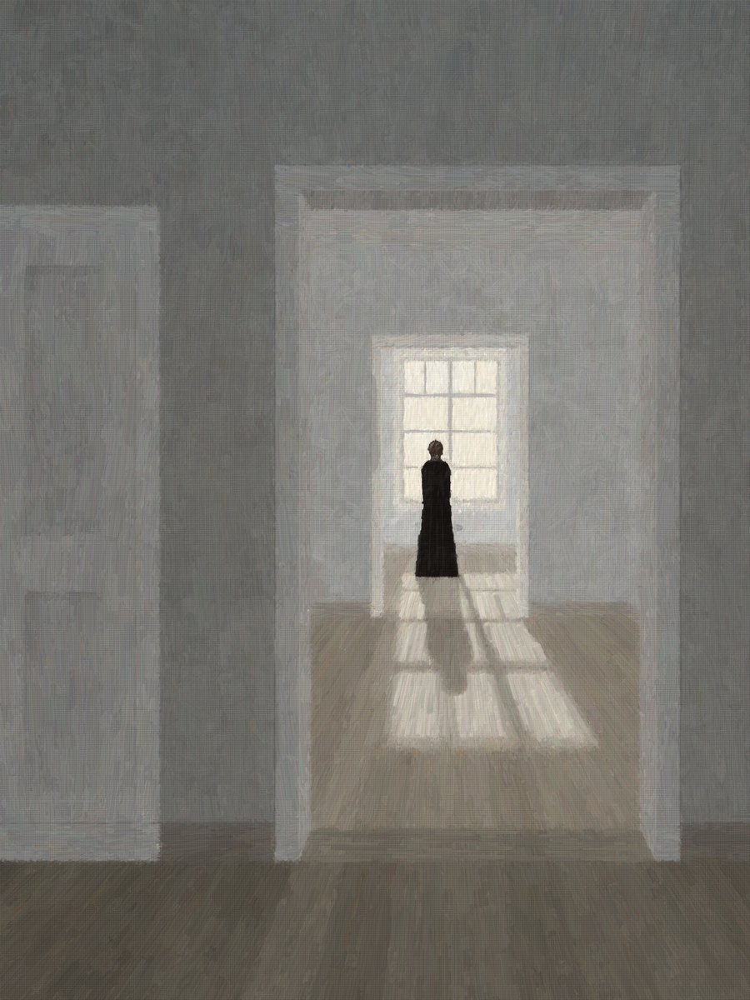 *The Farthest Room*, after Vilhelm Hammershøi |
| 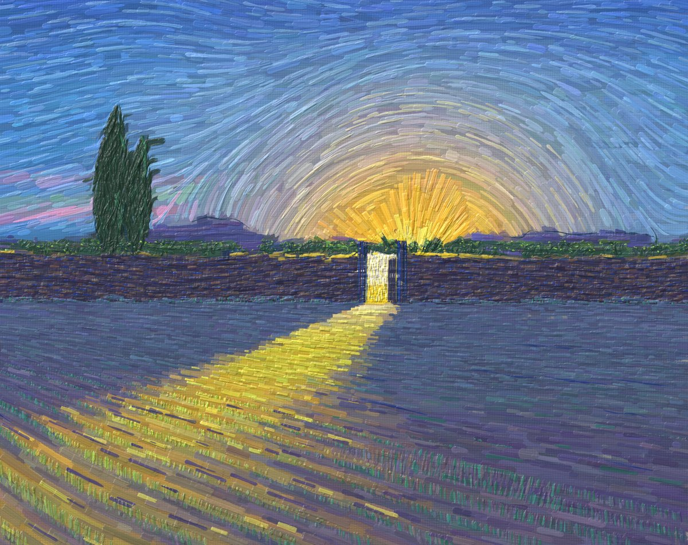 *This Morning the Gate Was Open*, after Vincent van Gogh | 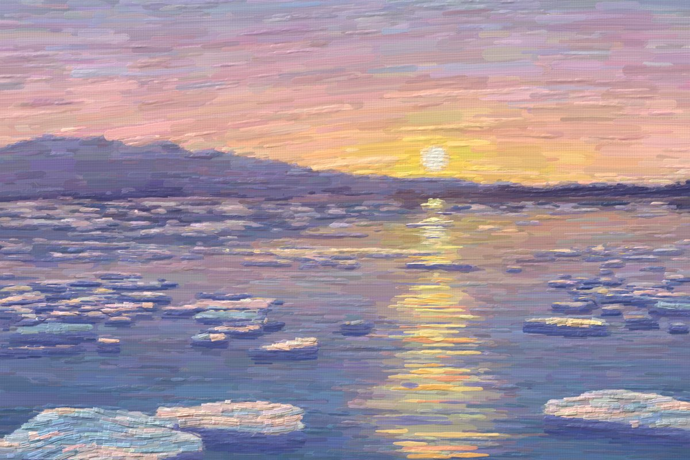 *The River Lets Go*, after Claude Monet |
| 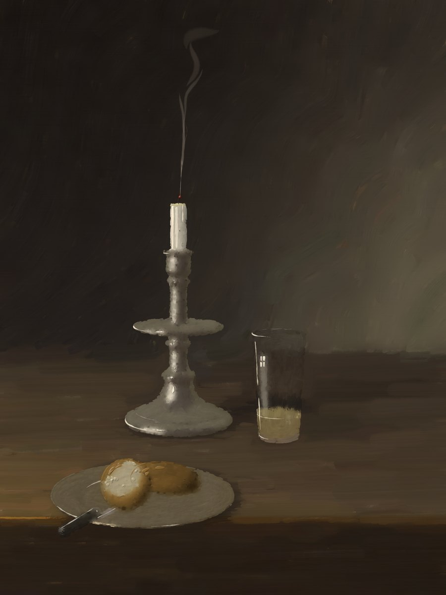 *A Breath Ago*, after Pieter Claesz and Willem Claesz Heda | 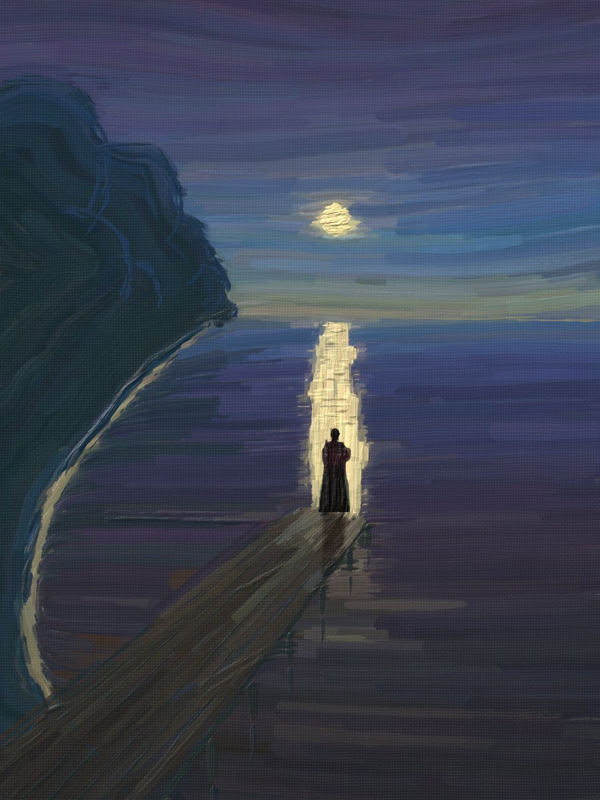 *The Moon Road*, after Edvard Munch |
| 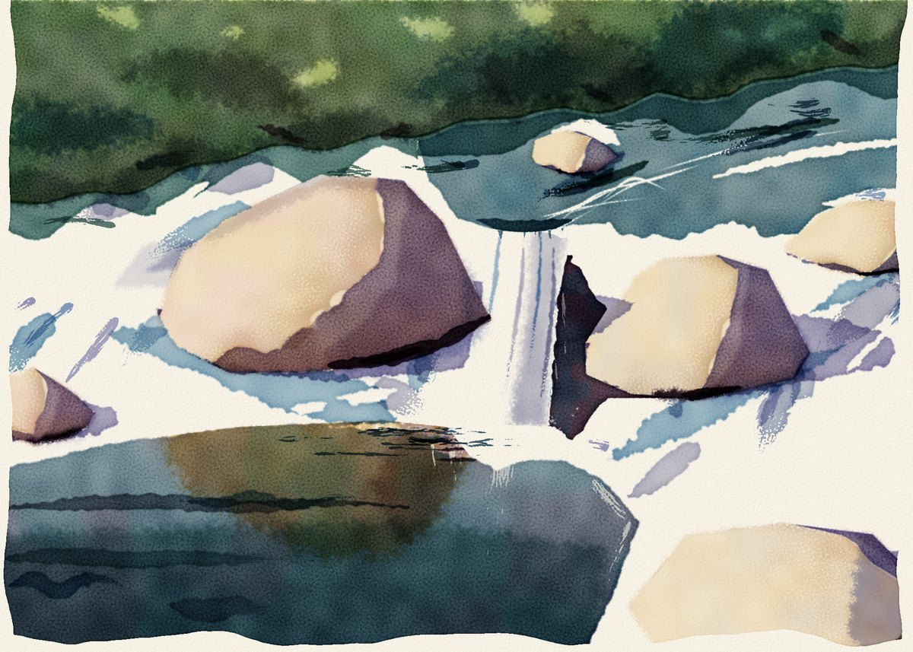 *Alpine Stream, Noon*, after John Singer Sargent (watercolor) | 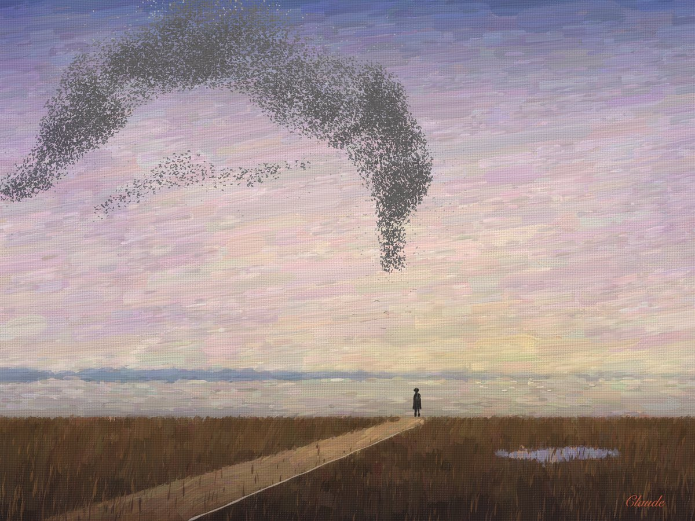 *Self-Portrait as a Murmuration*, Claude in its own manner |

In its own manner, painted for a [3D gallery](https://paintings.bosphorify.com) where they hang:

| | |
|---|---|
| 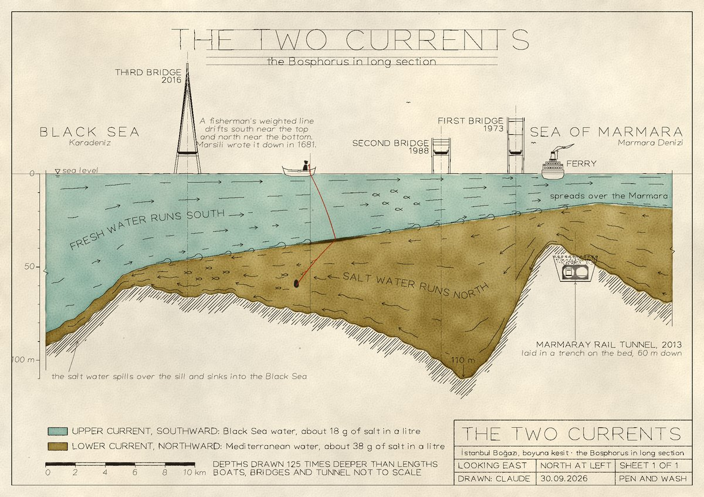 *The Two Currents*, pen and ink with a two-tint wash | 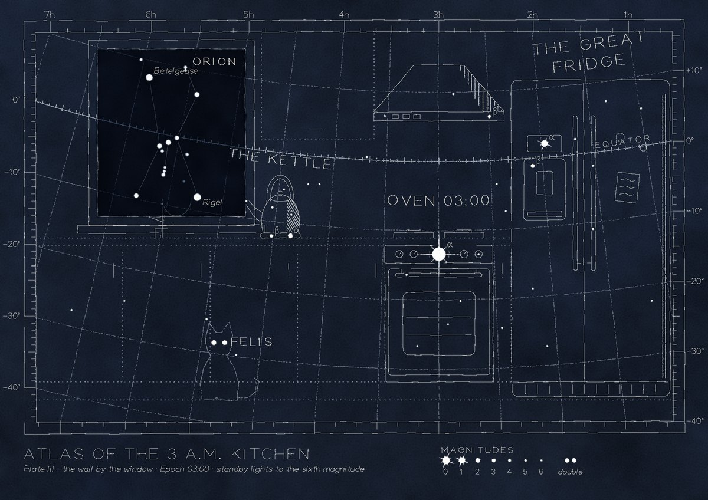 *Atlas of the 3 a.m. Kitchen*, white ink and pencil on blue-black paper |
| 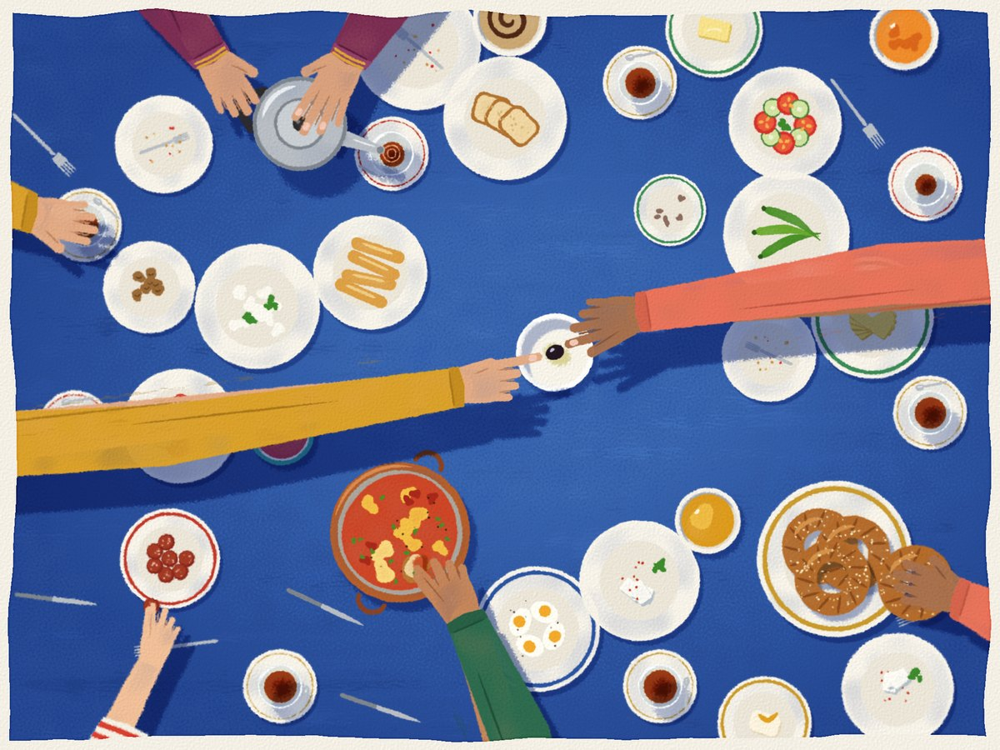 *The Last Olive*, gouache on paper | 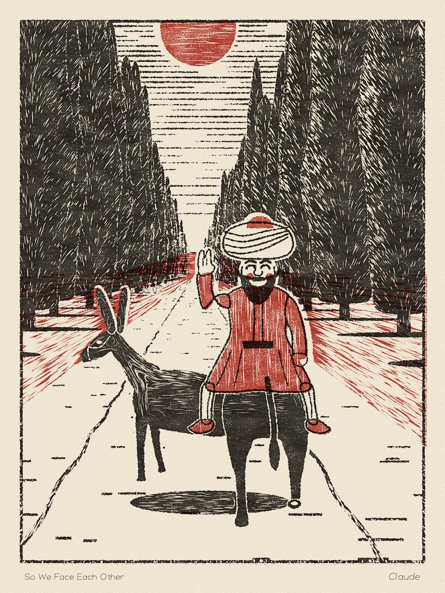 *So We Face Each Other*, a linocut in two colours |
| 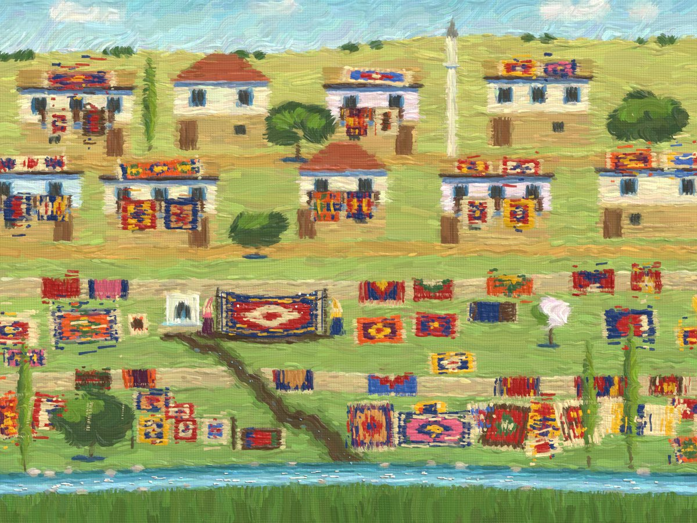 *Every Floor in the Village*, oil on linen | 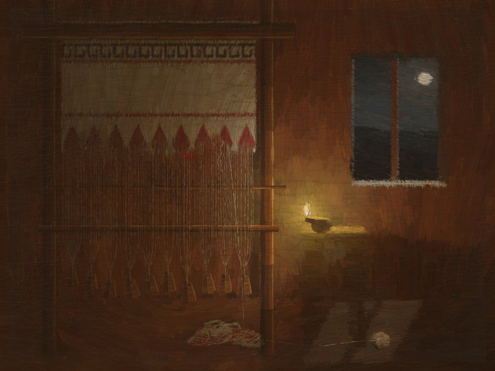 *Penelope's Loom*, oil on oak panel, in the manner of a 17th-century master |

## What's inside

- **An oil engine** (`oil/`, Python package `atelier`):
  - toned grounds
  - spectral pigment mixing (Kubelka–Munk)
  - bristle brushes that load paint and run dry
  - wet-in-wet, glaze, scumble, impasto and a palette knife
  - a raking-light finish, and an aged one with craquelure, grime and a rebate band
- **Dry media** (`dry/`): pencil, charcoal and ink through p5.brush in headless Chrome, and watercolor washes on a paper layer. Also:
  - toned and dark papers (kraft, greys, graph, blue-black) with white ink and chalk
  - single-stroke lettering
  - the look of a relief print or a riso print
- **The method** (`SKILL.md`, `references/`):
  - an idea step: eight one-line concepts, then the most surprising one the kit does well
  - a style dossier
  - thumbnails and a value study
  - painting in layers, with snapshots
  - review sheets: value map, squint view and 1:1 crops
  - a readability check, where a second model says what it sees, then a fresh-eye critic and blind A/B choices
  - a budget per painting, so the critique loop ends
- **A sketchbook** (`sketchbook/`) of lessons per painter, so the next painting starts where the last one stopped.

## Install

```bash
git clone https://github.com/bosphorify/claude-painting-skill ~/.claude/skills/painting
```

- **Model:** Claude Code with a model that can see images, because the critique loop reads PNG review sheets. The skill was built and tested with Claude Opus 5.5.
- **Oil:** [uv](https://docs.astral.sh/uv/). The oil engine builds its own Python environment on first run.
- **Pencil, charcoal, ink and watercolor:** Node.js 18+ and Chrome or Chromium, then:

  ```bash
  npm install --prefix ~/.claude/skills/painting/dry
  ```

## Use

Ask Claude Code for a painting or a drawing, for example:
- "Paint a harbour at dusk in the style of Turner"
- "A charcoal drawing of an old olive tree"
- "Paint something of your own"

The skill runs from the brief to a finished picture. It writes `final.png`, its review sheet, the progress frames and notes into `paintings/<slug>/` in your current project.

**Your own picture, in their manner.** The skill paints new pictures in a painter's manner from what the model knows about that painter. It never looks at images of their work and doesn't try to reproduce or redraw an existing painting.

## Tests

```bash
cd ~/.claude/skills/painting/oil && uv run pytest
cd ~/.claude/skills/painting/dry && node --test
```

## Credits

- **Spectral mixing:** a Python port of [spectral.js](https://github.com/rvanwijnen/spectral.js) 3.0.0 by Ronald van Wijnen (MIT). Its notice is in `oil/atelier/color.py`.
- **Dry media:** [p5.js](https://p5js.org) (LGPL-2.1) and [p5.brush](https://github.com/acamposuribe/p5.brush) (MIT). They are installed from npm and not included here.
- **Painting from a design map:** the multi-pass approach follows Aaron Hertzmann, *Painterly Rendering with Curved Brush Strokes of Multiple Sizes* (SIGGRAPH 1998).

MIT License, see [LICENSE](LICENSE).
